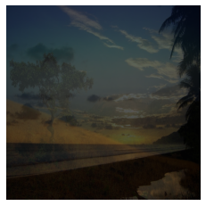
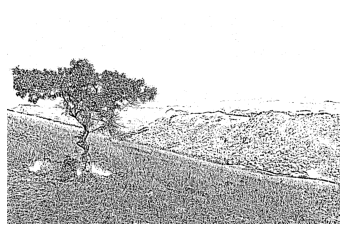

# Image Processing with OpenCV

This project contains examples and code snippets demonstrating various image processing and object detection techniques using OpenCV. Below is an overview of each topic, categorized by folders.

## Image Processing with OpenCV

1. **Blending**: Techniques for blending two or more images together.
2. **Blurring**: Image blurring techniques (Gaussian, Median, Bilateral, etc.).
3. **Gradients**: Techniques for detecting edges and corners in images using gradients.
4. **Histogram**: Image histogram analysis and equalization methods.
5. **Image Thresholding**: Image thresholding techniques (Binary, Adaptive Thresholding).
6. **Joining Images**: Methods for joining images horizontally or vertically.
7. **Morphological**: Morphological transformations (Erosion, Dilation, Opening, Closing).
8. **Open Image**: Opening and displaying image files.
9. **Resize & Crop**: Image resizing and cropping operations.
10. **Shape and Text**: Drawing shapes and adding text on images.
11. **Video Camera**: Capturing and processing live camera feed.
12. **Video Play**: Playing video files.
13. **Warp Perspective**: Techniques for changing and correcting image perspective.

  
  
  
  

## Object Detection with OpenCV

This section covers various object detection and tracking techniques using OpenCV.

1. **Cat Face Detection**: Detecting cat faces using Haar cascades.
2. **Contour Detection**: Detecting contours of objects in images.
3. **Corner Detection**: Corner detection techniques (Harris, Shi-Tomasi).
4. **Detection and Tracking**: Basic techniques for object detection and tracking.
5. **Edge Detection**: Edge detection methods (Sobel, Canny).
6. **Face Detection**: Detecting human faces using Haar cascades and DNN.
7. **Feature Matching**: Feature matching between images (ORB, SIFT, SURF).
8. **Own Cascade Detection**: Creating custom Haar cascades with your own training set.
9. **Pedestrian Detection**: Pedestrian detection using HOG and SVM methods.
10. **Template Matching**: Template matching techniques in images.
11. **Watershed**: Image segmentation using the Watershed algorithm.
